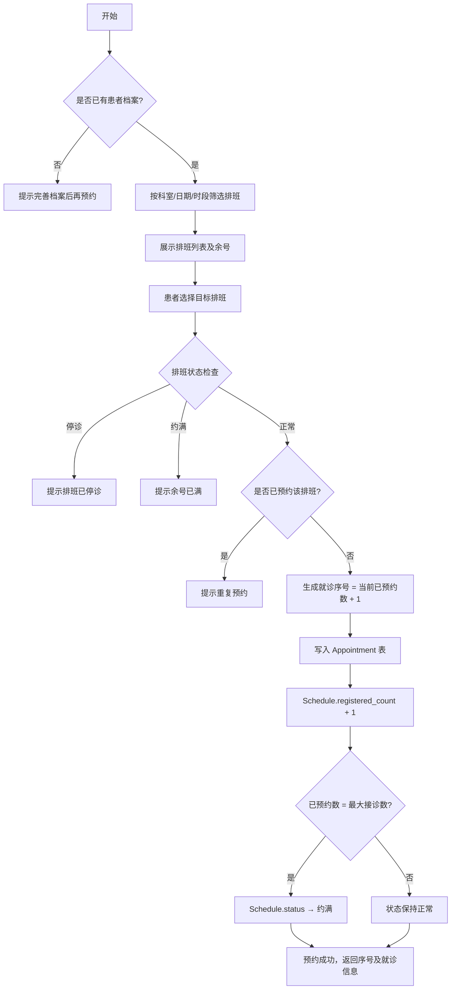
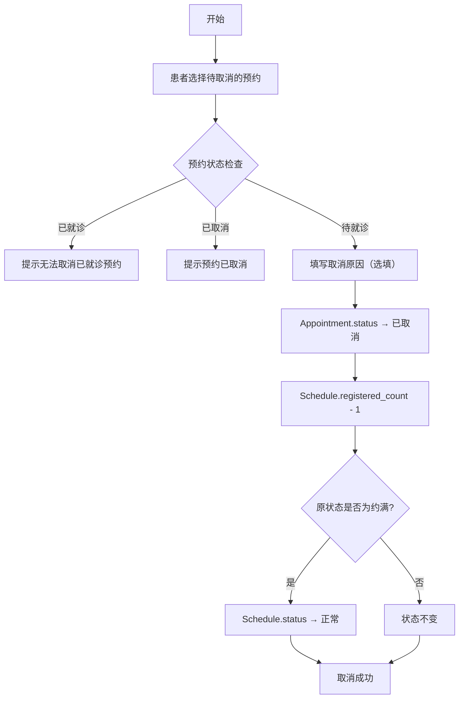
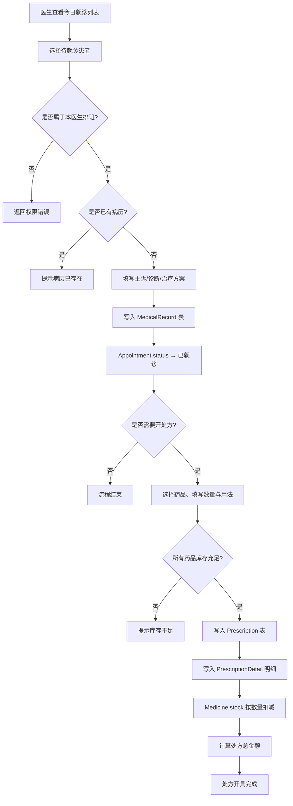
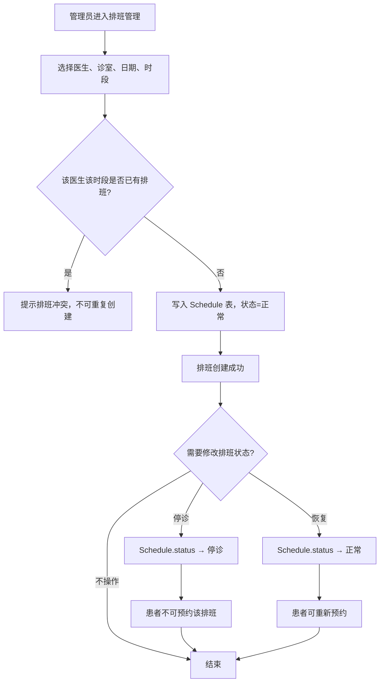

# 医院预约系统

## 应用场景

本系统面向医院的日常门诊预约业务，旨在解决患者挂号难、排队时间长、就诊信息不透明等问题。系统服务于三类用户：**患者**可在线浏览科室与医生信息、选择号源预约挂号、查看就诊记录及处方；**医生**可查看当日就诊列表、录入病历、开具处方；**管理员**负责维护科室、诊室、排班、药品等基础数据，并通过统计看板掌握医院整体运营情况。系统以 PostgreSQL 为数据存储后端，FastAPI 提供 RESTful 接口，Vue 3 实现前端交互，三端分角色登录，权限隔离，保障数据安全与业务合规。

## 功能列表

| 功能名称 | 功能简述 |
|---------|---------|
| 用户注册与登录 | 支持患者、医生两种角色注册，账号密码登录，JWT 鉴权，登出清除会话 |
| 患者档案管理 | 患者首次登录后完善真实姓名、身份证、性别等档案信息，后续可更新联系方式 |
| 科室与医生浏览 | 公开展示全院科室列表、诊室信息和医生详情（职称、擅长领域、简介） |
| 在线预约挂号 | 患者按科室/日期/时段筛选排班，查看余号后一键预约，系统自动分配就诊序号 |
| 预约管理 | 患者查看全部预约记录（按状态筛选），支持取消待就诊预约并填写取消原因 |
| 排班管理 | 管理员为指定医生创建出诊排班（日期、时段、诊室、最大接诊数），支持停诊/恢复操作 |
| 就诊病历录入 | 医生查看今日就诊列表，为已就诊患者录入主诉、诊断结果和治疗方案，形成病历 |
| 处方开具 | 医生在病历基础上选择药品、填写数量与用法开具处方，系统自动扣减库存并计算金额 |
| 药品库存管理 | 管理员维护药品目录（名称、规格、单价、分类），并随时调整库存数量 |
| 统计数据查看 | 管理员查看全院患者数、医生数、预约完成率、今日就诊量等运营统计数据 |

## 核心业务流程

### 功能1：用户注册与登录

```mermaid
flowchart TD
    A[开始] --> B[填写账号/密码/角色]
    B --> C{账号是否已存在?}
    C -->|是| D[返回错误：用户名已存在]
    D --> B
    C -->|否| E[bcrypt 加密密码写入 Users 表]
    E --> F[注册成功，跳转登录页]
    F --> G[输入账号密码]
    G --> H{凭证是否正确?}
    H -->|否| I[返回错误：用户名或密码错误]
    I --> G
    H -->|是| J[签发 JWT Token，返回角色信息]
    J --> K{角色判断}
    K -->|patient| L[跳转患者首页]
    K -->|doctor|  M[跳转医生工作台]
    K -->|admin|   N[跳转管理后台]
```

**文字描述**：用户在注册页填写账号、密码和角色类型，系统校验账号唯一性后将 bcrypt 哈希值写入 Users 表。登录时系统验证账号密码，通过后签发有效期 24 小时的 JWT Token，前端存入 localStorage 并根据角色自动跳转对应首页。

---

### 功能2：在线预约挂号



**文字描述**：患者在首页筛选条件后查看可用排班，点击预约后系统依次检查患者档案、排班状态（停诊/约满/已预约），全部通过后原子性地写入预约记录并更新排班计数。若计数达到上限则自动将排班状态更新为"约满"。

---

### 功能3：取消预约



**文字描述**：患者在预约列表中选择状态为"待就诊"的预约进行取消操作，系统校验状态后将预约标记为"已取消"，同时将对应排班的已预约数减一，若该排班之前因额满被标记为"约满"则自动恢复为"正常"，释放号源。

---

### 功能4：就诊病历录入与处方开具



**文字描述**：医生在今日就诊列表中选择患者，系统校验该预约属于本医生的排班后允许录入病历。病历保存后预约状态自动变为"已就诊"。如需开处方，医生选择药品和用量，系统校验库存充足后原子性地写入处方和明细记录、扣减库存并计算总金额。

---

### 功能5：管理员排班管理



**文字描述**：管理员在排班管理页选择医生、诊室、出诊日期和时段创建排班，系统通过联合唯一约束（doctor_id, work_date, time_period）防止重复创建。排班创建后可随时设置为"停诊"状态（如医生请假），患者端该排班将不显示；停诊解除后恢复为"正常"。
