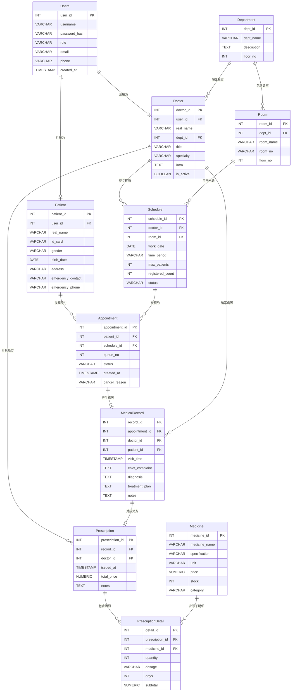

# 医院预约系统数据库设计文档

## 第一部分：概念模型（ER图）



## 第二部分：逻辑模型（关系模式与数据字典）

### Users（用户表）

| 属性名称 | 属性域（类型及长度） | 是否允许为空 | 默认值 | 完整性约束说明 |
|---------|-------------------|------------|--------|--------------|
| user_id | INT | 否 | 自增 | 主键，自增序列 |
| username | VARCHAR(50) | 否 | 无 | 唯一，登录账号 |
| password_hash | VARCHAR(128) | 否 | 无 | 存储密码哈希值，非空 |
| role | VARCHAR(10) | 否 | 'patient' | CHECK(role IN ('admin','patient','doctor'))，角色枚举 |
| email | VARCHAR(100) | 是 | NULL | 唯一，允许为空 |
| phone | VARCHAR(20) | 是 | NULL | 联系电话 |
| created_at | TIMESTAMP | 否 | CURRENT_TIMESTAMP | 注册时间，自动填充 |

### Patient（患者表）

| 属性名称 | 属性域（类型及长度） | 是否允许为空 | 默认值 | 完整性约束说明 |
|---------|-------------------|------------|--------|--------------|
| patient_id | INT | 否 | 自增 | 主键，自增序列 |
| user_id | INT | 否 | 无 | 外键→Users(user_id)，级联删除，唯一（一个用户只能是一名患者） |
| real_name | VARCHAR(50) | 否 | 无 | 患者真实姓名，非空 |
| id_card | VARCHAR(18) | 否 | 无 | 身份证号，唯一约束 |
| gender | VARCHAR(4) | 否 | 无 | CHECK(gender IN ('男','女')) |
| birth_date | DATE | 是 | NULL | 出生日期 |
| address | VARCHAR(200) | 是 | NULL | 家庭住址 |
| emergency_contact | VARCHAR(50) | 是 | NULL | 紧急联系人姓名 |
| emergency_phone | VARCHAR(20) | 是 | NULL | 紧急联系人电话 |

### Department（科室表）

| 属性名称 | 属性域（类型及长度） | 是否允许为空 | 默认值 | 完整性约束说明 |
|---------|-------------------|------------|--------|--------------|
| dept_id | INT | 否 | 自增 | 主键，自增序列 |
| dept_name | VARCHAR(50) | 否 | 无 | 科室名称，唯一约束 |
| description | TEXT | 是 | NULL | 科室简介 |
| floor_no | INT | 是 | NULL | 所在楼层 |

### Doctor（医生表）

| 属性名称 | 属性域（类型及长度） | 是否允许为空 | 默认值 | 完整性约束说明 |
|---------|-------------------|------------|--------|--------------|
| doctor_id | INT | 否 | 自增 | 主键，自增序列 |
| user_id | INT | 否 | 无 | 外键→Users(user_id)，级联删除，唯一 |
| real_name | VARCHAR(50) | 否 | 无 | 医生真实姓名，非空 |
| dept_id | INT | 否 | 无 | 外键→Department(dept_id)，所属科室 |
| title | VARCHAR(20) | 否 | 无 | CHECK(title IN ('主任医师','副主任医师','主治医师','住院医师'))，职称枚举 |
| specialty | VARCHAR(100) | 是 | NULL | 擅长领域描述 |
| intro | TEXT | 是 | NULL | 医生个人简介 |
| is_active | BOOLEAN | 否 | TRUE | 是否在职，用于停诊/离职标记 |

### Room（诊室表）

| 属性名称 | 属性域（类型及长度） | 是否允许为空 | 默认值 | 完整性约束说明 |
|---------|-------------------|------------|--------|--------------|
| room_id | INT | 否 | 自增 | 主键，自增序列 |
| dept_id | INT | 否 | 无 | 外键→Department(dept_id)，所属科室 |
| room_name | VARCHAR(50) | 否 | 无 | 诊室名称 |
| room_no | VARCHAR(20) | 否 | 无 | 诊室编号，全院唯一 |
| floor_no | INT | 是 | NULL | 所在楼层 |

### Schedule（排班表）

| 属性名称 | 属性域（类型及长度） | 是否允许为空 | 默认值 | 完整性约束说明 |
|---------|-------------------|------------|--------|--------------|
| schedule_id | INT | 否 | 自增 | 主键，自增序列 |
| doctor_id | INT | 否 | 无 | 外键→Doctor(doctor_id)，出诊医生 |
| room_id | INT | 否 | 无 | 外键→Room(room_id)，出诊诊室 |
| work_date | DATE | 否 | 无 | 出诊日期 |
| time_period | VARCHAR(10) | 否 | 无 | CHECK(time_period IN ('上午','下午','晚上'))，时间段枚举 |
| max_patients | INT | 否 | 20 | CHECK(max_patients > 0)，最大接诊人数 |
| registered_count | INT | 否 | 0 | 列级：CHECK(registered_count >= 0)；表级约束 chk_registered_le_max：CHECK(registered_count <= max_patients)，已预约人数不超过最大接诊数 |
| status | VARCHAR(10) | 否 | '正常' | CHECK(status IN ('正常','停诊','约满'))，排班状态 |

> 联合唯一约束：(doctor_id, work_date, time_period)，同一医生同一天同一时段只能有一条排班记录。
>
> **业务说明**：当 `registered_count` 增加至等于 `max_patients` 时，应将 `status` 更新为 `'约满'`；当预约被取消导致 `registered_count` 减少时，若原状态为 `'约满'` 则恢复为 `'正常'`。此联动逻辑由应用层（或数据库触发器）维护，DDL 层仅保证数值约束。

### Appointment（预约表）

| 属性名称 | 属性域（类型及长度） | 是否允许为空 | 默认值 | 完整性约束说明 |
|---------|-------------------|------------|--------|--------------|
| appointment_id | INT | 否 | 自增 | 主键，自增序列 |
| patient_id | INT | 否 | 无 | 外键→Patient(patient_id)，预约患者 |
| schedule_id | INT | 否 | 无 | 外键→Schedule(schedule_id)，对应排班 |
| queue_no | INT | 否 | 无 | CHECK(queue_no > 0)，就诊序号 |
| status | VARCHAR(10) | 否 | '待就诊' | CHECK(status IN ('待就诊','已就诊','已取消','爽约'))，预约状态 |
| created_at | TIMESTAMP | 否 | CURRENT_TIMESTAMP | 预约创建时间 |
| cancel_reason | VARCHAR(200) | 是 | NULL | 取消原因，仅status='已取消'时填写 |

> 联合唯一约束1：(schedule_id, queue_no)，同一排班内序号不重复。
> 联合唯一约束2：(patient_id, schedule_id)，同一患者同一排班只能预约一次。

### MedicalRecord（病历表）

| 属性名称 | 属性域（类型及长度） | 是否允许为空 | 默认值 | 完整性约束说明 |
|---------|-------------------|------------|--------|--------------|
| record_id | INT | 否 | 自增 | 主键，自增序列 |
| appointment_id | INT | 否 | 无 | 外键→Appointment(appointment_id)，唯一（一次预约对应一份病历） |
| doctor_id | INT | 否 | 无 | 外键→Doctor(doctor_id)，主治医生 |
| patient_id | INT | 否 | 无 | 外键→Patient(patient_id)，冗余存储以便快速查询 |
| visit_time | TIMESTAMP | 否 | CURRENT_TIMESTAMP | 实际就诊时间 |
| chief_complaint | TEXT | 是 | NULL | 主诉（患者自述症状） |
| diagnosis | TEXT | 是 | NULL | 诊断结果 |
| treatment_plan | TEXT | 是 | NULL | 治疗方案 |
| notes | TEXT | 是 | NULL | 医生备注 |

### Prescription（处方表）

| 属性名称 | 属性域（类型及长度） | 是否允许为空 | 默认值 | 完整性约束说明 |
|---------|-------------------|------------|--------|--------------|
| prescription_id | INT | 否 | 自增 | 主键，自增序列 |
| record_id | INT | 否 | 无 | 外键→MedicalRecord(record_id)，唯一（一份病历对应一张处方） |
| doctor_id | INT | 否 | 无 | 外键→Doctor(doctor_id)，开具医生 |
| issued_at | TIMESTAMP | 否 | CURRENT_TIMESTAMP | 处方开具时间 |
| total_price | NUMERIC(10,2) | 是 | NULL | CHECK(total_price >= 0)，处方总金额 |
| notes | TEXT | 是 | NULL | 处方备注（用药注意事项等） |

### Medicine（药品表）

| 属性名称 | 属性域（类型及长度） | 是否允许为空 | 默认值 | 完整性约束说明 |
|---------|-------------------|------------|--------|--------------|
| medicine_id | INT | 否 | 自增 | 主键，自增序列 |
| medicine_name | VARCHAR(100) | 否 | 无 | 药品名称，非空 |
| specification | VARCHAR(100) | 否 | '' | 规格（如 500mg×24片），空规格填空字符串，确保 UNIQUE(medicine_name, specification) 约束有效 |
| unit | VARCHAR(20) | 否 | 无 | 计量单位（盒/支/片/瓶） |
| price | NUMERIC(10,2) | 否 | 无 | CHECK(price >= 0)，单价 |
| stock | INT | 否 | 0 | CHECK(stock >= 0)，库存数量 |
| category | VARCHAR(50) | 是 | NULL | 药品分类（抗生素/消炎药/中成药等） |

> 联合唯一约束：(medicine_name, specification)，同名同规格视为同一药品。

### PrescriptionDetail（处方明细表，多对多中间表）

| 属性名称 | 属性域（类型及长度） | 是否允许为空 | 默认值 | 完整性约束说明 |
|---------|-------------------|------------|--------|--------------|
| detail_id | INT | 否 | 自增 | 主键，自增序列 |
| prescription_id | INT | 否 | 无 | 外键→Prescription(prescription_id)，级联删除 |
| medicine_id | INT | 否 | 无 | 外键→Medicine(medicine_id) |
| quantity | INT | 否 | 无 | CHECK(quantity > 0)，数量 |
| dosage | VARCHAR(100) | 是 | NULL | 用法用量（如 每日三次，每次一片） |
| days | INT | 是 | NULL | CHECK(days > 0)，用药天数 |
| subtotal | NUMERIC(10,2) | 是 | NULL | CHECK(subtotal >= 0)，小计金额 |

> 联合唯一约束：(prescription_id, medicine_id)，同一处方内同一药品只出现一次。

## 第三部分：物理模型（DDL 脚本）

```sql
-- ============================================
-- 医院预约系统数据库DDL脚本
-- 目标数据库：PostgreSQL 15+
-- 字符集：UTF-8
-- ============================================

-- 若需重建，先删除旧表（注意顺序，先删有外键依赖的子表）
-- DROP TABLE IF EXISTS PrescriptionDetail, Prescription, Medicine,
--     MedicalRecord, Appointment, Schedule, Room,
--     Doctor, Patient, Department, Users CASCADE;


-- -----------------------------------------------
-- 1. 用户表
-- -----------------------------------------------
CREATE TABLE Users (
    user_id       SERIAL PRIMARY KEY,                            -- 主键，自增
    username      VARCHAR(50)  NOT NULL,                         -- 登录账号，非空
    password_hash VARCHAR(128) NOT NULL,                         -- 密码哈希，非空
    role          VARCHAR(10)  NOT NULL DEFAULT 'patient'        -- 角色，默认患者
                  CHECK (role IN ('admin', 'patient', 'doctor')),
    email         VARCHAR(100),                                  -- 邮箱，可为空
    phone         VARCHAR(20),                                   -- 手机号，可为空
    created_at    TIMESTAMP NOT NULL DEFAULT CURRENT_TIMESTAMP,  -- 注册时间
    CONSTRAINT uk_user_username UNIQUE (username),               -- 账号唯一
    CONSTRAINT uk_user_email    UNIQUE (email)                   -- 邮箱唯一
);


-- -----------------------------------------------
-- 2. 患者表
-- -----------------------------------------------
CREATE TABLE Patient (
    patient_id        SERIAL PRIMARY KEY,
    user_id           INT         NOT NULL,                      -- 外键，关联用户
    real_name         VARCHAR(50) NOT NULL,                      -- 真实姓名，非空
    id_card           VARCHAR(18) NOT NULL,                      -- 身份证号，非空
    gender            VARCHAR(4)  NOT NULL
                      CHECK (gender IN ('男', '女')),            -- 性别枚举
    birth_date        DATE,                                      -- 出生日期
    address           VARCHAR(200),                              -- 家庭住址
    emergency_contact VARCHAR(50),                               -- 紧急联系人
    emergency_phone   VARCHAR(20),                               -- 紧急联系电话
    CONSTRAINT fk_patient_user FOREIGN KEY (user_id)
        REFERENCES Users(user_id) ON DELETE CASCADE,           -- 用户删除则患者记录同步删除
    CONSTRAINT uk_patient_id_card UNIQUE (id_card),             -- 身份证唯一
    CONSTRAINT uk_patient_user   UNIQUE (user_id)               -- 一个用户只能绑定一个患者档案
);


-- -----------------------------------------------
-- 3. 科室表
-- -----------------------------------------------
CREATE TABLE Department (
    dept_id     SERIAL PRIMARY KEY,
    dept_name   VARCHAR(50) NOT NULL,                            -- 科室名称，非空
    description TEXT,                                            -- 科室简介
    floor_no    INT,                                             -- 所在楼层
    CONSTRAINT uk_dept_name UNIQUE (dept_name)                  -- 科室名称唯一
);


-- -----------------------------------------------
-- 4. 医生表
-- -----------------------------------------------
CREATE TABLE Doctor (
    doctor_id SERIAL PRIMARY KEY,
    user_id   INT         NOT NULL,                              -- 外键，关联用户
    real_name VARCHAR(50) NOT NULL,                              -- 真实姓名，非空
    dept_id   INT         NOT NULL,                              -- 外键，所属科室
    title     VARCHAR(20) NOT NULL
              CHECK (title IN ('主任医师', '副主任医师', '主治医师', '住院医师')),  -- 职称枚举
    specialty VARCHAR(100),                                      -- 擅长领域
    intro     TEXT,                                              -- 个人简介
    is_active BOOLEAN NOT NULL DEFAULT TRUE,                     -- 是否在职
    CONSTRAINT fk_doctor_user FOREIGN KEY (user_id)
        REFERENCES Users(user_id) ON DELETE CASCADE,
    CONSTRAINT fk_doctor_dept FOREIGN KEY (dept_id)
        REFERENCES Department(dept_id),
    CONSTRAINT uk_doctor_user UNIQUE (user_id)                  -- 一个用户只能是一名医生
);


-- -----------------------------------------------
-- 5. 诊室表
-- -----------------------------------------------
CREATE TABLE Room (
    room_id   SERIAL PRIMARY KEY,
    dept_id   INT         NOT NULL,                              -- 外键，所属科室
    room_name VARCHAR(50) NOT NULL,                              -- 诊室名称
    room_no   VARCHAR(20) NOT NULL,                              -- 诊室编号，全院唯一
    floor_no  INT,                                               -- 所在楼层
    CONSTRAINT fk_room_dept FOREIGN KEY (dept_id)
        REFERENCES Department(dept_id),
    CONSTRAINT uk_room_no UNIQUE (room_no)                      -- 诊室编号唯一
);


-- -----------------------------------------------
-- 6. 排班表
-- -----------------------------------------------
CREATE TABLE Schedule (
    schedule_id      SERIAL PRIMARY KEY,
    doctor_id        INT         NOT NULL,                       -- 外键，出诊医生
    room_id          INT         NOT NULL,                       -- 外键，出诊诊室
    work_date        DATE        NOT NULL,                       -- 出诊日期
    time_period      VARCHAR(10) NOT NULL
                     CHECK (time_period IN ('上午', '下午', '晚上')),  -- 时间段枚举
    max_patients     INT NOT NULL DEFAULT 20
                     CHECK (max_patients > 0),                   -- 最大接诊数
    registered_count INT NOT NULL DEFAULT 0
                     CHECK (registered_count >= 0),              -- 已预约数
    status           VARCHAR(10) NOT NULL DEFAULT '正常'
                     CHECK (status IN ('正常', '停诊', '约满')), -- 排班状态枚举
    CONSTRAINT fk_schedule_doctor FOREIGN KEY (doctor_id)
        REFERENCES Doctor(doctor_id),
    CONSTRAINT fk_schedule_room FOREIGN KEY (room_id)
        REFERENCES Room(room_id),
    CONSTRAINT uk_schedule UNIQUE (doctor_id, work_date, time_period),  -- 同一医生同天同时段只排一次
    CONSTRAINT chk_registered_le_max
        CHECK (registered_count <= max_patients)                 -- 已预约不超过上限
);


-- -----------------------------------------------
-- 7. 预约表
-- -----------------------------------------------
CREATE TABLE Appointment (
    appointment_id SERIAL PRIMARY KEY,
    patient_id     INT         NOT NULL,                         -- 外键，预约患者
    schedule_id    INT         NOT NULL,                         -- 外键，对应排班
    queue_no       INT         NOT NULL CHECK (queue_no > 0),    -- 就诊序号，正整数
    status         VARCHAR(10) NOT NULL DEFAULT '待就诊'
                   CHECK (status IN ('待就诊', '已就诊', '已取消', '爽约')),  -- 预约状态
    created_at     TIMESTAMP   NOT NULL DEFAULT CURRENT_TIMESTAMP,  -- 预约时间
    cancel_reason  VARCHAR(200),                                  -- 取消原因（取消时填写）
    CONSTRAINT fk_appt_patient FOREIGN KEY (patient_id)
        REFERENCES Patient(patient_id),
    CONSTRAINT fk_appt_schedule FOREIGN KEY (schedule_id)
        REFERENCES Schedule(schedule_id),
    CONSTRAINT uk_appt_queue UNIQUE (schedule_id, queue_no),    -- 同一排班内序号不重复
    CONSTRAINT uk_appt_patient_schedule UNIQUE (patient_id, schedule_id)  -- 同一患者同一排班只能预约一次
);


-- -----------------------------------------------
-- 8. 病历表
-- -----------------------------------------------
CREATE TABLE MedicalRecord (
    record_id       SERIAL PRIMARY KEY,
    appointment_id  INT       NOT NULL,                          -- 外键，关联预约
    doctor_id       INT       NOT NULL,                          -- 外键，主治医生
    patient_id      INT       NOT NULL,                          -- 外键，冗余存储便于快速查询
    visit_time      TIMESTAMP NOT NULL DEFAULT CURRENT_TIMESTAMP,  -- 就诊时间
    chief_complaint TEXT,                                        -- 主诉
    diagnosis       TEXT,                                        -- 诊断结果
    treatment_plan  TEXT,                                        -- 治疗方案
    notes           TEXT,                                        -- 医生备注
    CONSTRAINT fk_record_appointment FOREIGN KEY (appointment_id)
        REFERENCES Appointment(appointment_id),
    CONSTRAINT fk_record_doctor FOREIGN KEY (doctor_id)
        REFERENCES Doctor(doctor_id),
    CONSTRAINT fk_record_patient FOREIGN KEY (patient_id)
        REFERENCES Patient(patient_id),
    CONSTRAINT uk_record_appointment UNIQUE (appointment_id)    -- 一次预约只产生一份病历
);


-- -----------------------------------------------
-- 9. 处方表
-- -----------------------------------------------
CREATE TABLE Prescription (
    prescription_id SERIAL PRIMARY KEY,
    record_id       INT       NOT NULL,                          -- 外键，关联病历
    doctor_id       INT       NOT NULL,                          -- 外键，开具医生
    issued_at       TIMESTAMP NOT NULL DEFAULT CURRENT_TIMESTAMP,  -- 开具时间
    total_price     NUMERIC(10, 2)
                    CHECK (total_price >= 0),                    -- 处方总金额
    notes           TEXT,                                        -- 用药注意事项等
    CONSTRAINT fk_prescription_record FOREIGN KEY (record_id)
        REFERENCES MedicalRecord(record_id),
    CONSTRAINT fk_prescription_doctor FOREIGN KEY (doctor_id)
        REFERENCES Doctor(doctor_id),
    CONSTRAINT uk_prescription_record UNIQUE (record_id)        -- 一份病历只对应一张处方
);


-- -----------------------------------------------
-- 10. 药品表
-- -----------------------------------------------
CREATE TABLE Medicine (
    medicine_id   SERIAL PRIMARY KEY,
    medicine_name VARCHAR(100) NOT NULL,                         -- 药品名称，非空
    specification VARCHAR(100) NOT NULL DEFAULT '',              -- 规格（如500mg×24片），空规格填空字符串
    unit          VARCHAR(20)  NOT NULL,                         -- 计量单位（盒/支/片）
    price         NUMERIC(10, 2) NOT NULL
                  CHECK (price >= 0),                            -- 单价，非负
    stock         INT NOT NULL DEFAULT 0
                  CHECK (stock >= 0),                            -- 库存数量，非负
    category      VARCHAR(50),                                   -- 药品分类
    CONSTRAINT uk_medicine_name_spec UNIQUE (medicine_name, specification)  -- 同名同规格唯一
);


-- -----------------------------------------------
-- 11. 处方明细表（多对多中间表：处方 ↔ 药品）
-- -----------------------------------------------
CREATE TABLE PrescriptionDetail (
    detail_id       SERIAL PRIMARY KEY,
    prescription_id INT NOT NULL,                                -- 外键，关联处方
    medicine_id     INT NOT NULL,                                -- 外键，关联药品
    quantity        INT NOT NULL CHECK (quantity > 0),           -- 数量，正整数
    dosage          VARCHAR(100),                                -- 用法用量
    days            INT CHECK (days > 0),                        -- 用药天数
    subtotal        NUMERIC(10, 2) CHECK (subtotal >= 0),        -- 小计金额
    CONSTRAINT fk_detail_prescription FOREIGN KEY (prescription_id)
        REFERENCES Prescription(prescription_id) ON DELETE CASCADE,  -- 处方删除则明细同步删除
    CONSTRAINT fk_detail_medicine FOREIGN KEY (medicine_id)
        REFERENCES Medicine(medicine_id),
    CONSTRAINT uk_detail_prescription_medicine UNIQUE (prescription_id, medicine_id)  -- 同一处方内同一药品只出现一次
);
```
